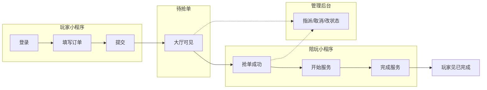

# P0-1 · 一期业务流程说明（demo 落地版）

> **对应任务**：产品负责人工作计划 · Phase 0 · P0-1。  
> **当前目标**：优先跑通 **可演示闭环**（真登录 + 真数据主路径），非完整商业化版本。  
> **依据**：`../../三角洲陪玩派单小程序-快速落实计划.md`（用户端仅微信小程序 + PC 管理后台）。

---

## 1. 角色与终端

| 角色 | 使用终端 | 说明（demo） |
|------|----------|----------------|
| 玩家 | 微信小程序 | 发起订单、查看进度、在允许节点取消 |
| 陪玩 | 微信小程序（可与玩家 **同端不同入口/Tab**） | 在大厅抢单、接单后推进状态 |
| 管理员 | PC 管理后台（浏览器） | 看全量订单、必要时改派/强制改状态/取消（demo 兜底） |

**demo 约定**：测试账号由俱乐部准备至少 3 类：**玩家 1、陪玩 1、管理员 1**（管理员可为账号密码登录后台，与总计划一致）。

---

## 2. 名词（对内对外）

| 对内（研发/后台） | 对用户可见文案（可再润色） |
|-------------------|---------------------------|
| 订单 | 订单 |
| 待抢单 / 待接单（大厅中） | 「等待接单」或「待陪玩接单」 |
| 已接单 | 「已接单」 |
| 服务中 | 「服务中」 |
| 已完成 | 「已完成」 |
| 已取消 | 「已取消」 |

状态机细节在 **P2** 单独冻结；本文只描述业务流程走向。

---

## 3. 一期派单方式（demo 默认）

**派单能力单一真源**：**公共抢单**、**玩家点名（客户指定陪玩）**、**管理端指派** 的**冻结结论**以 **`P0-2-一期派单模式决策.md` §1 / §1.2** 为准；本节仅为流程叙述；若与 P0-2 冲突，**以 P0-2 为准**。

> **交叉引用**：公共池下 **抢单 vs 管理员指派** 见 **P0-2 §1.1**；**点名单** 见 **§1.2**；管理员能否覆盖点名见 **P0-3 §4.4**（默认 **不覆盖**）。

**一期交付**：**公共大厅抢单 + 玩家点名 + 管理端指派**（三者规则见上）。

- **未点名**：玩家下单后订单进入 **公共待抢单池**，出现在陪玩侧 **大厅**，任意 **可接单陪玩** 可 **抢单**。
- **已点名（客户就要某陪玩）**：下单时指定陪玩 → 订单 **仅对该陪玩** 展示为可接（**不** 对其他陪玩显示为公共可抢单）；由该陪玩 **接单**（**P0-2 §1.2**）。
- **管理端指派**：对 **公共待抢单**（未点名）订单，管理员可 **指派陪玩**；**已点名未接** 单默认 **不** 用指派改给他人（**P0-3 §4.4**），仅可 **取消** 等。
- **并发**：公共池内 **抢单 vs 指派** 由 **P0-2 §1.1** 串行裁决；产品验收见总计划 Phase 2。

**说明**：若资源不足须砍 **点名/指派/大厅** 之一，须 **书面变更** 并同步 **P0-2、P0-3、接口表**。

---

## 4. 定价与结算（demo）

| 项 | demo 规则 |
|----|-----------|
| 页面上如何展示 | 下单页展示 **服务 SKU**（例如：游戏《三角洲行动》、区服、时长档位、**展示价**）；可为固定几项下拉，不接复杂计算器。**可选**：**点名陪玩**（客户指定某位陪玩，见 **P0-2 §1.2**）。 |
| 实际钱怎么收 | **线下结算**（微信外沟通/转账），系统内 **不接入微信支付**；订单仅作「约定内容 + 状态」记录。 |
| 发票/对账 | **不做**（Phase 4 再立项）。 |

---

## 5. 主流程（ happy path ）

### 5.1 玩家侧（小程序）

1. 打开小程序 → **微信登录** → 进入首页（或默认到「下单」）。  
2. 选择服务类型 / 区服 / 时长等（字段以接口表为准，demo 可最少字段）。  
3. **（可选）点名陪玩**：客户指定某位陪玩则勾选/选择；不选则走 **公共大厅抢单**（**P0-2 §1.2**）。  
4. 填写备注（可选）→ 提交订单。  
5. 订单进入 **待分配陪玩**（公共池或点名单，见 P0-2），玩家在 **订单列表/详情** 可看到状态（点名单可展示「已指定陪玩，等待对方接单」类文案，**P1-2**）。  
6. 订单被 **陪玩抢单 / 接单成功**（含点名单由被点名人接）或 **管理员指派成功**（仅适用于公共池等，见 **P0-3 §4.4**）→ 玩家侧 **已接单** → 陪玩「开始服务」→ **服务中**。  
7. 服务结束后陪玩标记完成（或管理后台确认）→ 玩家侧 **已完成**。

### 5.2 陪玩侧（小程序）

1. 登录同一小程序（**陪玩身份**）→ 进入 **可接单列表**（**公共大厅** + **点给我的单**，可同页分栏，见 **P0-5** / 接口表 **B**）。  
2. 浏览订单卡片（关键信息：服务摘要、备注、下单时间、**是否被客户点名** 等）。  
3. 对 **自己有权限接的单** 点击 **抢单/接单**（公共单多人抢、点名单仅本人，**P0-2 §1.2**）→ 成功则进入 **我的进行中订单**。  
4. 在订单详情中：**开始服务** → **完成服务**（文案在 Phase 1 文案包统一）。

### 5.3 管理员侧（PC 后台）

1. 登录管理后台。  
2. **订单列表**：筛选、查看详情（玩家/陪玩/状态/时间/日志 demo 级）。  
3. **一期必备**：订单详情展示 **是否玩家点名**；对 **允许指派** 的 **公共待抢单** 订单 **指派陪玩**（与公共抢单互斥，**P0-2 §1.1**）；**已点名未接** 默认 **不** 指派给他人（**P0-3 §4.4**）。对异常单 **取消**、必要时 **强制改状态**。  
4. **已接单后改绑陪玩**：默认 **不做独立流程**（见 **P0-3 §4.3**）。

---

## 6. 异常与边界（demo 最小集）

| 场景 | 产品规则（demo） |
|------|------------------|
| 玩家想取消 | **仅当订单尚未被陪玩接单成功时**（公共池或点名单均可，以 P2-1 为准），允许玩家按规则取消；已进入「已接单」及之后 **不由玩家自助取消**（文案见 P0-4）。 |
| 长时间无人抢 / 点名人不接 | **公共单**：管理员 **指派** 或 **取消**；**点名单**：默认 **不** 改派他人（**P0-3 §4.4**），可 **取消** 后让玩家重下或线下沟通。 |
| 双陪玩同时点抢单 | 仅一人成功；失败方提示「手慢了，订单已被接」类文案（Phase 1 文案包）。 |
| 争议、退款、差评 | **一期 demo 不做** 完整流程；记录进「不做清单」（见后续 P0-3 文档）。 |

---

## 7. 流程简图（便于评审）

---

## 8. 与俱乐部对齐清单（待打勾）

demo 落地前，负责人确认即可；若与下表不一致，请改本文并知会研发。

- [ ] 派单方式确认为 **公共抢单 + 玩家点名 + 管理端指派**（与 P0-2 一致；若砍能力须书面变更）  
- [ ] SKU 字段（区服/时长/展示价）是否够用  
- [ ] 线下结算口径已与陪玩/财务口头一致  
- [ ] 测试用玩家/陪玩/管理员账号已备  

---

## 9. 未决事项与闭合位置

> **本文定位**：P0-1 是 **业务流程与叙事** 的共识稿，**不是** 接口契约终稿、**不是** 订单状态机终稿。以下事项必须在指定期限前由对应文档**拍板并回填**，避免团队把本页误当「已全部定死」。

| 未决事项 | 闭合责任文档 | 建议闭合时点（门禁） | 闭合后应出现的结果（示例） |
|----------|----------------|----------------------|----------------------------|
| 玩家 / 陪玩 **账号与角色关系**（同 openid 多角色是否允许、如何切换、测试号约定） | **P1-4**（`../产品负责人工作计划.md`）+ **`接口表-v0.md`** 中登录/用户角色相关条目 | **Phase 1 退出前**（与「玩家/陪玩可见空壳页」同门禁） | 文档或接口表写明：角色来源、切换入口、鉴权字段 |
| 管理端 **改派** 后的 **订单状态**、玩家/陪玩 **列表与详情可见性**（是否通知、旧陪玩是否仍可见等） | **P2-1**（订单状态机专文，见产品计划 Phase 2） | **Phase 2 状态机冻结时**（开发实现状态迁移前） | 状态机图 + 各端展示规则表 |
| 「**联系客服**」一期是否落地（入口、文案、是否外链/企微） | **`P0-3-一期范围与不做清单.md` §4.2** + **P1-2**（文案包 v0）定措辞 | **P0-3 书面确认时** 定是否做；**Phase 1 文案冻结** 前落地文案或明确「不做」时的替代提示 | §4.2 勾选 + 文案表一行或纯文案替代（默认不做外链，见 P0-3） |
| **待抢单 → 指派** 接口与后台交互 | **`P0-3-一期范围与不做清单.md` §4.1**（默认 **B 必做**） | **Phase 0～1 交界**（最迟不晚于接口表 v0 联调前） | **`接口表-v0.md`** 含行为 **D**；与 **P0-2 §1.1** 一致 |

**联调真源优先级（避免误用本文）**：`接口表-v0.md`（路径/字段/错误码） > **P2-1 状态机** > P0-2（派单策略与裁决）> **P0-1**（流程叙述）。

---

## 10. 修订记录

| 版本 | 日期 | 说明 |
|------|------|------|
| v0.1 | 2026-04-02 | 初稿：对齐总计划 demo/MVP，默认抢单大厅 + 线下结算 |
| v0.2 | 2026-04-02 | 增补 §3 与 P0-2 单一真源引用；新增 §9 未决事项与闭合位置；明确本文非接口/状态机终稿 |
| v0.3 | 2026-04-03 | 一期 **抢单 + 指派** 双能力；§3/§5.3/§6/§8/§9 与 P0-2 v0.3、P0-3 v0.2 对齐 |
| v0.4 | 2026-04-03 | 增补 **玩家点名（客户指定陪玩）**；与 **P0-2 §1.2**、**P0-3 §4.4** 对齐 |
| v1.0 | （待定） | **冻结**：俱乐部与研发按 §8、§9 完成确认且与 P0-2/P0-3 v1.0 同批冻结；升版前仍为草案 |
